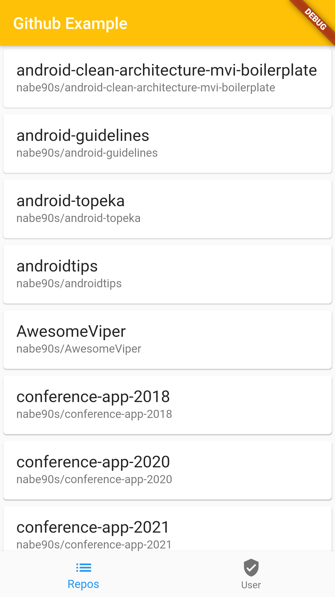

# flutter_github_example

fig1|fig2
---|---
|

# Tech Stacks

## Architecture

https://medium.com/flutter-community/using-the-bloc-pattern-for-clean-flutter-apps-theory-and-a-practical-example-b5dcad728a2b

* [flutter_bloc](https://pub.dev/packages/flutter_bloc)

## Networking and JSON serialization
https://medium.com/mindful-engineering/retrofit-the-easiest-way-to-call-rest-apis-is-flutter-fe55d1e7c5c2

* [retrofit](https://pub.dev/packages/retrofit)
* [dio](https://pub.dev/packages/dio)
* [json_serializable](https://pub.dev/packages/json_serializable)

## Other

* [equatable](https://pub.dev/packages/equatable)
